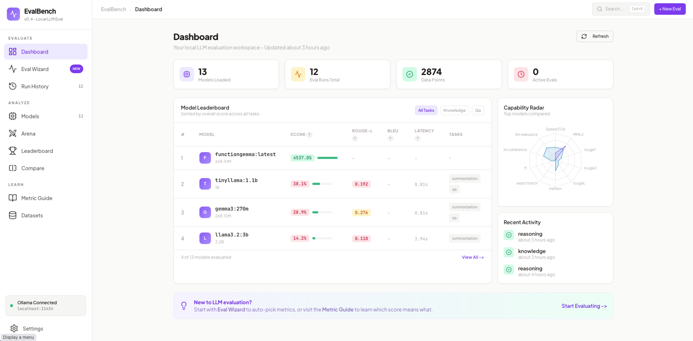
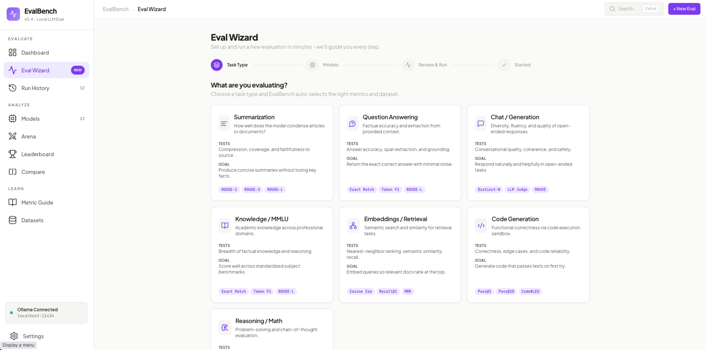
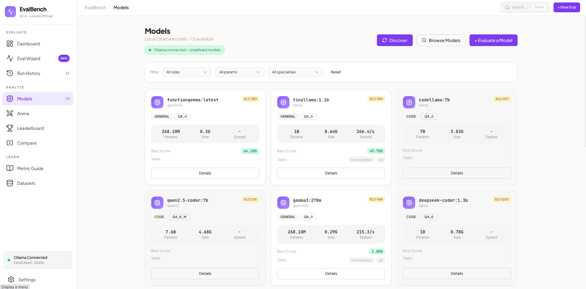
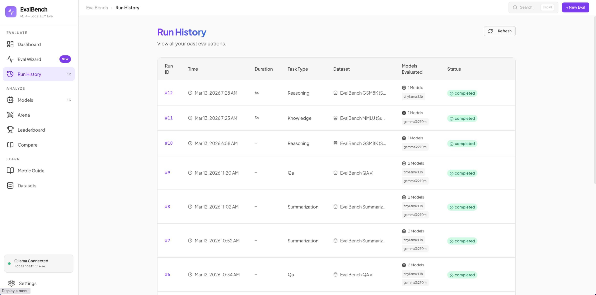
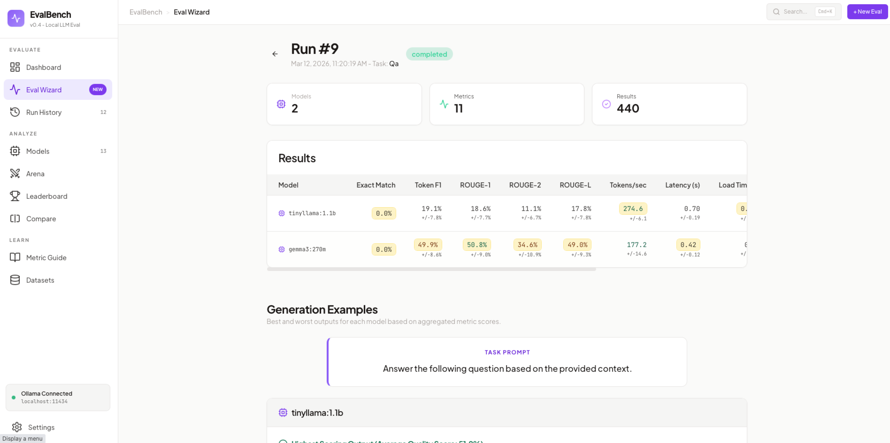
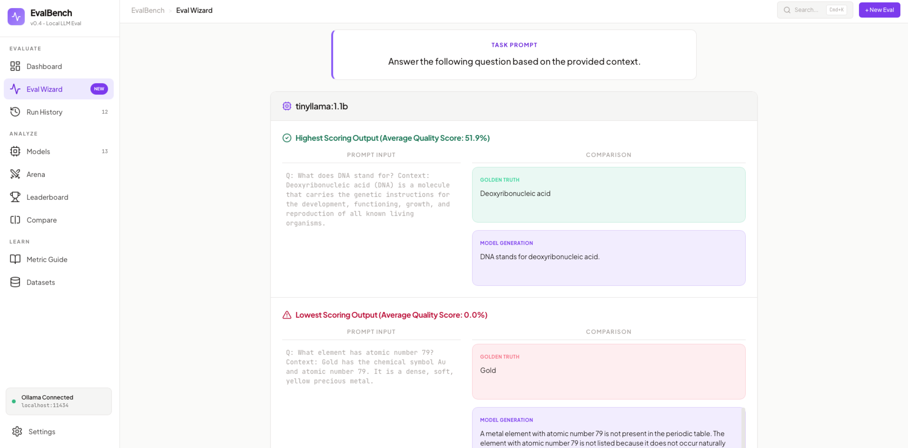
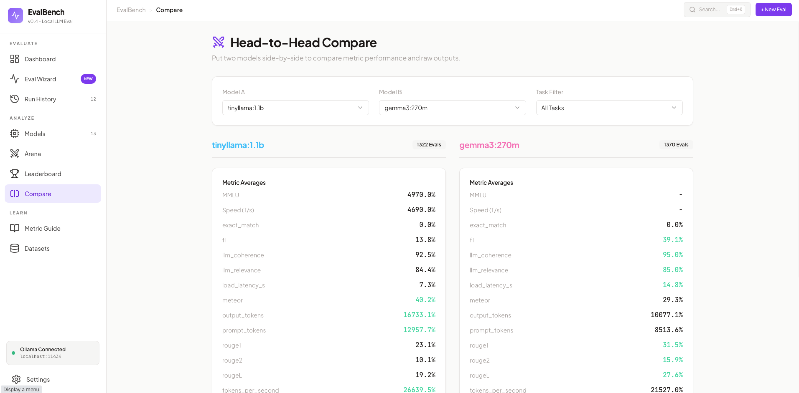
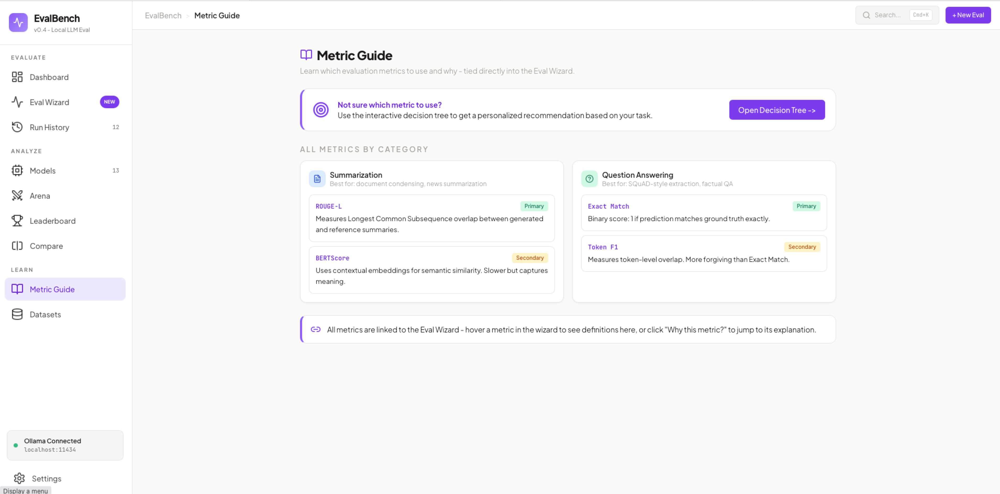
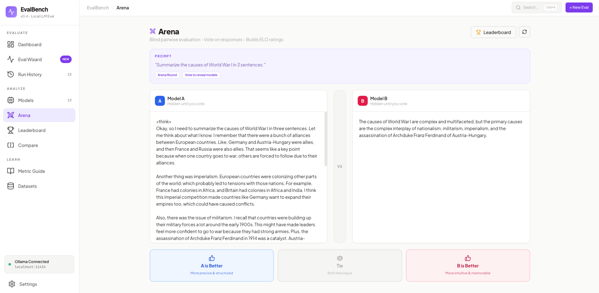
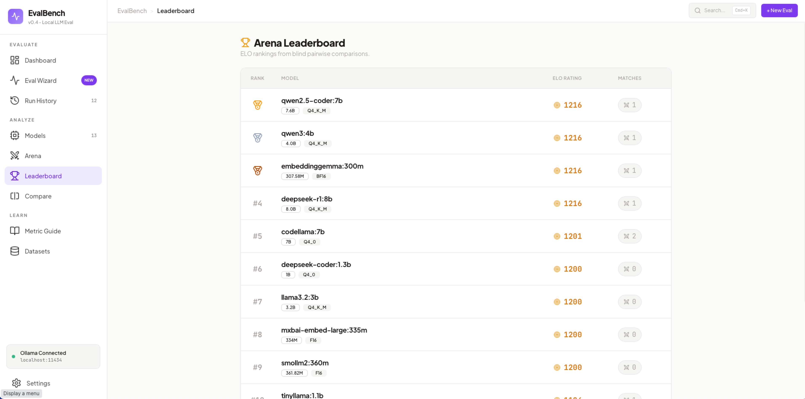

# EvalBench

**Local-first LLM evaluation workbench** for running real metrics, tracking runs, and comparing models — with an educational layer that teaches *why* each metric exists.

[](./README.md)
[](./README.md)
[](./README.md)
[](./README.md)

**Status**: v0.5 - Evaluation Engine + UI Refresh (Reference Metrics, Run History/Details, Metric Guide)

---

## Table of Contents

- [Why EvalBench](#why-evalbench)
- [Architecture](#architecture)
- [Core Concepts](#core-concepts)
- [Features](#features)
- [Technical Stack](#technical-stack)
- [How It Works](#how-it-works)
- [Setup & Installation](#setup--installation)
- [How to Run and Stop](#how-to-run-and-stop)
- [Roadmap](#roadmap)
- [Contributing](#contributing)

---

## Why EvalBench

EvalBench is built for people who **run local models and care about measurable quality**. It bridges two worlds:
1. **Practical evaluation**: real scores, reproducible runs, and model-to-model comparison.
2. **Learning**: an embedded decision tree that explains *which metric to use and why*.

If you want “LM Studio but for evaluation,” this is it.

## Design

#### **Landing/Dashboard Page**



#### Eval Wizard



#### Model Cards



#### **Eval History**




#### Eval/Run Detail





#### Head-to-Head Compare 




#### Metrics Guide



#### Battle Arena and Leaderboard






## Architecture

EvalBench uses a **local-first** architecture optimized for privacy and speed. It separates a lightweight, reactive frontend from a heavy, computational Python backend.

```
┌─────────────────────────────────────────────────────────────┐
│                    Frontend (React + Vite)                  │
│  ┌──────────────┬──────────────┬──────────────┬──────────┐  │
│  │  Dashboard   │ Eval Wizard  │  Compare     │  Arena   │  │
│  └──────────────┴──────────────┴──────────────┴──────────┘  │
└─────────────────────────────────────────────────────────────┘
                             ↕ REST API + Server-Sent Events (SSE)
┌─────────────────────────────────────────────────────────────┐
│            Backend (Python FastAPI)                         │
│  ┌──────────────┬──────────────┬──────────────┐             │
│  │  Scoring     │ Eval Runner  │  Ollama      │             │
│  │  Algorithms  │ (vLLM later) │  Integration │             │
│  └──────────────┴──────────────┴──────────────┘             │
└─────────────────────────────────────────────────────────────┘
                             ↕
               SQLite Database (evalbench.db)
```

## Core Concepts

### 1. Traditional Reference Metrics
We use established Python libraries (`rouge-score`, `sacrebleu`, `nltk`) to compute metrics like ROUGE, BLEU, Exact Match, Token F1, and Distinct-1/2 locally against Ground-Truth Golden Datasets. Datasets are seeded from inline subsets at startup (no external downloads).

### 2. LLM-as-A-Judge (Planned)
For subjective generation (like Chat or Summarization), EvalBench will optionally prompt a strong "Judge Model" (e.g. OpenAI, Anthropic, or a local Llama 3) to grade outputs on Coherence, Fluency, and Relevance, outputting a 1-5 score and a written rationale.

### 3. Statistical Rigor (Basic)
EvalBench computes mean scores and margin of error where supported. Expanded confidence intervals and significance testing are planned.

---

## Features

- **Model Discovery**: Auto-detects local Ollama models.
- **Task-Aware Wizard**: Select a Task Type (Knowledge, Chat, Code) and EvalBench automatically suggests the correct metrics (Exact Match vs ROUGE vs LLM Judge) and standard benchmark dataset (MMLU vs TruthfulQA).
- **Capability Signatures**: Multi-dimensional Radar charts to visualize model strengths and weaknesses.
- **Head-to-Head Compare**: Pit two models side-by-side on specific tasks to see sample outputs and metric averages.
- **Arena Mode**: Pairwise blind testing where you vote on the best response, calculating a chess-style ELO rating.
- **Educational Layer**: The `Learn` tab links to the interactive Metric Decision Tree used in the app.
- **Run History & Details**: Track runs over time, compare per-model metrics, and inspect example outputs side-by-side.
- **Model Profiles**: Dedicated model details page with run history, best scores, and recent outputs.

---

## Technical Stack

| Layer | Technology |
|-------|-----------|
| **Frontend UI** | React 18, Vite, Tailwind CSS, Shadcn UI |
| **Routing & State** | Wouter, TanStack React Query |
| **Charts** | Recharts |
| **Backend Framework** | Python 3, FastAPI |
| **Database** | SQLite (via SQLAlchemy ORM) |
| **Validation** | Pydantic v2 (Backend) + Zod (Frontend) |
| **Scoring Libs** | `rouge-score`, `sacrebleu`, `nltk`, `scipy` |

---

## Setup & Installation

### Prerequisites
1. **Node.js**: v18 or higher (for the frontend React app)
2. **Python**: v3.11 or higher (for the backend API and metric computation)
3. **Ollama**: Installed locally and running on `http://localhost:11434` (with at least one model pulled)
4. **uv**: (Optional but recommended) Lightning-fast Python package installer

### Installation Steps

1. **Clone and Install Frontend**
```bash
git clone <repo>
cd evalbench
npm install
```

2. **Install Backend Dependencies**
EvalBench uses a synchronized `concurrently` script that will automatically use `uv` to install the Python dependencies listed in `backend/requirements.txt` the first time you run the backend.

*(If you don't have `uv` installed, the system will attempt to use standard `pip`)*

If you want to install Python deps explicitly up front, run:
```bash
uv sync
```
Or use the npm helper:
```bash
npm run py:install
```

---

## How to Run and Stop

### 🟢 Starting the App

You can start the entire stack (both the Vite Frontend and the FastAPI Backend) with a **single command** from the root `EvalBench` directory:

```bash
npm run dev
```

This command uses `concurrently` to spin up two processes:
- **Frontend** runs on `http://localhost:5173`
- **Backend** runs on `http://localhost:8001` (Note: The frontend automatically proxies `/api` requests to this port).

Open `http://localhost:5173` in your browser to view EvalBench.

### 🔴 Stopping the App
To stop the application, simply go to the terminal window where it is currently running and press:

**`Ctrl + C`**

This will gracefully terminate both the Frontend Vite server and the Backend FastAPI server simultaneously. Make sure to close the browser tab to avoid any lingering connection attempts.

---

## Roadmap

- LLM‑as‑Judge (G‑Eval) + Settings for API keys
- HumanEval / code benchmarks + execution harness
- Statistical rigor: confidence intervals and significance tests
- Dataset builder (CSV/JSON) + export formats

See [BACKLOG.md](./docs/superpowers/plans/BACKLOG.md) for full details.

---

## Contributing

Ideas, issues, and PRs are welcome. If you’re proposing a new metric or dataset, please include:
- The benchmark source + license
- Expected metric behavior
- A small seed subset for quick local tests

---

## License
MIT
