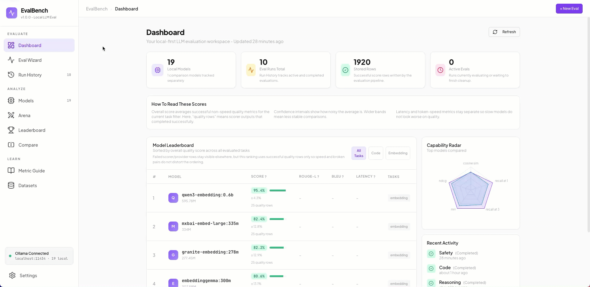
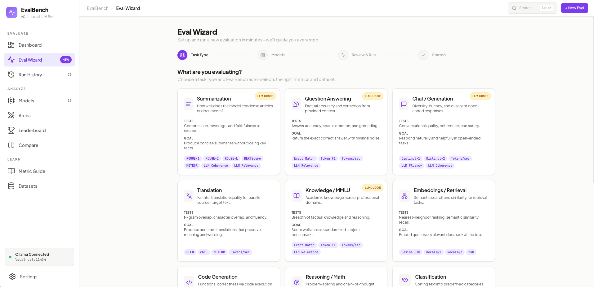
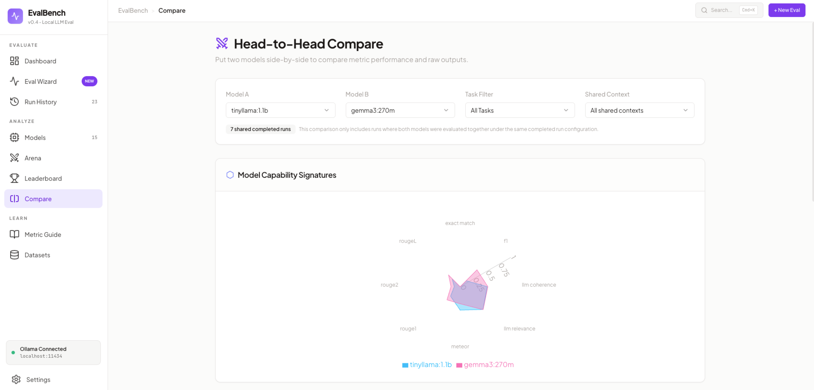

# EvalBench

**Local-first LLM evaluation workbench** for Ollama users who want trustworthy metrics, fair model comparisons, and faster iteration loops.

[](./README.md)
[](./README.md)
[](./README.md)
[](./README.md)
[](./README.md)
[](./README.md)
[](./README.md)
[](./README.md)

**Status**: v1.0.0 - Local-first eval workbench with trusted runs, optional judge scoring, frontier comparisons, Arena battles, and custom dataset tooling; 3 published releases with canonical changelog in GitHub Releases.

---

## Table of Contents

- [Why EvalBench](#why-evalbench)
- [Why It's Different](#why-its-different)
- [Quickstart (60 Seconds)](#quickstart-60-seconds)
- [Real Usage Example](#real-usage-example)
- [Demo](#demo)
- [Architecture](#architecture)
- [Core Concepts](#core-concepts)
- [Features](#features)
- [Try in 5 Minutes](#try-in-5-minutes)
- [Public Status](#public-status)
- [Releases](#releases)
- [Technical Stack](#technical-stack)
- [Setup & Installation](#setup--installation)
- [How to Run and Stop](#how-to-run-and-stop)
- [Validation](#validation)
- [Roadmap](#roadmap)
- [Contributing](#contributing)

---

## Why EvalBench

EvalBench is for builders who run local models and want evidence, not vibes.

It gives you one practical loop:
1. **Benchmark quality with real metrics** across tasks like summarization, code, RAG, knowledge, and embeddings.
2. **Compare local models against frontier models** in the same run when you need an external baseline.
3. **Inspect reliability and failure context** so run quality and run health are both visible.
4. **Create your own golden datasets** so evaluations match your actual use case, not generic demos.

This project started as a teaching tool for students to learn golden datasets, metrics, and LLM-as-Judge without writing heavy pipeline code.

If you want "LM Studio for evaluation" with stronger rigor and dataset control, this is it.

## Why It's Different

- **Local-first by design**: EvalBench is intentionally single-user and local-first, with SQLite on-device and encrypted key storage.
- **Hybrid evaluation without platform lock-in**: keep Ollama as your center, then optionally add OpenAI/Gemini/Claude/Groq models for comparison.
- **Objective + subjective scoring in one flow**: combine reference metrics with optional LLM-as-Judge scoring and rationale.
- **Dataset creation is a core feature**: build, import, version, and safely manage custom datasets from inside the product.
- **Two modes of truth**: metric-based head-to-head comparison plus human preference testing via blind Arena battles and ELO.
- **Educational layer included**: built-in metric guidance helps teams learn why each score exists, not just what the number is.

## Quickstart (60 Seconds)

1. Start Ollama locally and ensure at least one model is pulled.
2. Install dependencies and start EvalBench:

```bash
npm install
npm run dev
```

3. Open http://localhost:5173.
4. Go to Eval Wizard, choose a task, select models, and run your first evaluation.

## Real Usage Example

Example: compare two local models on Question Answering.

1. Open Eval Wizard.
2. Choose Question Answering.
3. Select two local Ollama models (for example tinyllama:1.1b and gemma3:270m).
4. Start the run and open Run Details.
5. Review Exact Match and Token F1 plus run health fields (failed pairs, retries, cache hits).
6. Export results as JSON, Markdown, or CSV.

Expected outcome:
- You get model-by-model score differences on the same dataset/context.
- You can inspect best/worst examples before deciding which model to ship.
- You can share reproducible output with your team from the export files.

## Demo

### Product Overview (GIF)


### Eval Wizard Walkthrough (GIF)


## Screenshots

### Eval Wizard — Run a benchmark in seconds


### Arena — Blind pairwise voting with ELO


### Head-to-Head Compare


## Architecture

EvalBench uses a **local-first** architecture optimized for privacy and speed. It separates a lightweight, reactive frontend from a heavy, computational Python backend.

```
┌─────────────────────────────────────────────────────────────┐
│                    Frontend (React + Vite)                  │
│  ┌──────────────┬──────────────┬──────────────┬──────────┐  │
│  │  Dashboard   │ Eval Wizard  │  Compare     │  Arena   │  │
│  └──────────────┴──────────────┴──────────────┴──────────┘  │
└─────────────────────────────────────────────────────────────┘
                             ↕ REST API + Server-Sent Events (SSE)
┌─────────────────────────────────────────────────────────────┐
│            Backend (Python FastAPI)                         │
│  ┌──────────────┬──────────────┬──────────────┐             │
│  │  Scoring     │ Eval Runner  │  Ollama      │             │
│  │  Algorithms  │ (vLLM later) │  Integration │             │
│  └──────────────┴──────────────┴──────────────┘             │
└─────────────────────────────────────────────────────────────┘
                             ↕
               SQLite Database (evalbench.db)
```

## Core Concepts

### 1. Traditional Reference Metrics
We use established Python libraries (`rouge-score`, `sacrebleu`, `nltk`) to compute metrics like ROUGE, BLEU, Exact Match, Token F1, and Distinct-1/2 locally against Ground-Truth Golden Datasets. Datasets are seeded from inline subsets at startup (no external downloads).

### 2. LLM-as-Judge (Optional)
For subjective generation tasks, EvalBench can optionally use a configured judge model to score outputs on criteria such as coherence, fluency, and relevance, returning both a score and rationale. Judge providers are loaded lazily so optional SDKs do not block the core app, and judge scoring can be turned off entirely from Settings when you want objective-only runs.

### 3. Statistical Rigor And Reliability
EvalBench computes mean scores and margin of error where supported, and now separates quality from reliability by tracking failed pairs, retries, cache hits, cancellation state, and success rate for each run.

---

## Features

- **Local model benchmarking first**: Auto-discovers Ollama models and keeps the primary catalog local-first.
- **Mixed local + frontier evaluation**: Add selected OpenAI/Gemini/Claude/Groq models as comparison baselines in the same run.
- **Optional LLM-as-Judge**: Turn judge scoring on or off from Settings; when enabled, judge rationale is available in run analysis.
- **Task-aware eval wizard**: Task selection drives metrics and benchmark dataset defaults with estimated runtime context.
- **Custom dataset builder and registry**: Manually create or import CSV/JSON datasets, version by name, and safely delete unused user-authored sets.
- **Trusted run lifecycle**: Live progress, cancellation, retries, partial-failure visibility, cache-hit tracking, and clear run health indicators.
- **Head-to-head compare**: Fair model comparison based on shared completed run contexts with clearer significance framing.
- **Arena battles with ELO**: Run blind pairwise matchups (random or manual model-vs-model) and update leaderboard ratings.
- **Export anywhere**: Download results as **JSON**, **Markdown**, or **CSV** from Run Details.
- **Built to teach**: Learn tab and metric guidance explain why each metric fits each task.

---

## Try in 5 Minutes

1. Pull or discover 2 local Ollama models in Models.
2. Open Eval Wizard and start a benchmark run on a built-in dataset.
3. (Optional) Enable one frontier comparison model in Settings and run mixed local + cloud.
4. Open Run Details to inspect quality metrics, run health, and example outputs.
5. Export the run as JSON, Markdown, or CSV.
6. Launch Arena to run a blind battle and vote your preferred output.

---

## Public Status

- Stable version: v1.0.0
- Release history: 3 tagged releases
- Canonical changelog: [GitHub Releases](https://github.com/tatwan/EvalBench/releases)
- Validation baseline: npm run check and pytest -q

## Releases

GitHub Releases are the canonical changelog for EvalBench and include shipped features, user impact, validation evidence, and upgrade notes.

- [View Releases](https://github.com/tatwan/EvalBench/releases)

### Release Quality Checklist (recommended)

- Scope summary: **What shipped** and user impact: **Why it matters**
- Explicit upgrade notes: breaking changes, migration steps, config/env changes
- Validation evidence: `npm run check`, `pytest -q`, plus commit/tag reference

---

## Technical Stack

| Layer | Technology |
|-------|-----------|
| **Frontend UI** | React 18, Vite, Tailwind CSS, Shadcn UI |
| **Routing & State** | Wouter, TanStack React Query |
| **Charts** | Recharts |
| **Backend Framework** | Python 3, FastAPI |
| **Database** | SQLite (via SQLAlchemy ORM) |
| **Validation** | Pydantic v2 (Backend) + Zod (Frontend) |
| **Scoring Libs** | `rouge-score`, `sacrebleu`, `nltk`, `scipy` |

---

## Setup & Installation

### Prerequisites
1. **Node.js**: v18 or higher (for the frontend React app)
2. **Python**: v3.11 or higher (for the backend API and metric computation)
3. **Ollama**: Installed locally and running on `http://localhost:11434` (with at least one model pulled)
4. **uv**: Required for backend install/run, but you can install it with `pip` if it is missing

### Installation Steps

1. **Clone and Install Frontend**
```bash
git clone <repo>
cd evalbench
npm install
```

2. **Install Backend Dependencies**
EvalBench uses `pyproject.toml` dependency management (lockfile: `uv.lock`) as the source of truth.

If you want to install Python deps explicitly up front, run:
```bash
uv sync
```

If you do not have `uv`, install it first with pip:
```bash
python -m pip install uv
```

Then rerun:
```bash
uv sync
```

Or use the npm helper:
```bash
npm run py:install
```

### Security Note — Encryption Key Backup

On first run, EvalBench auto-generates an encryption key at `~/.evalbench_key` (chmod 600). All API keys entered in Settings are encrypted with this key before being stored in `evalbench.db`.

**Back up `~/.evalbench_key`.** If you lose this file, stored API keys become permanently unreadable and must be re-entered.

> This app is designed for single-user local use. Do not expose the backend port over a network.

---

## How to Run and Stop

### 🟢 Starting the App

You can start the entire stack (both the Vite Frontend and the FastAPI Backend) with a **single command** from the root `EvalBench` directory:

```bash
npm run dev
```

This command uses `concurrently` to spin up two processes:
- **Frontend** runs on `http://localhost:5173`
- **Backend** runs on `http://localhost:8001` (Note: The frontend automatically proxies `/api` requests to this port).

Open `http://localhost:5173` in your browser to view EvalBench.

### 🔴 Stopping the App
To stop the application, simply go to the terminal window where it is currently running and press:

**`Ctrl + C`**

This will gracefully terminate both the Frontend Vite server and the Backend FastAPI server simultaneously. Make sure to close the browser tab to avoid any lingering connection attempts.

---

## Validation

Use these commands before shipping changes:

```bash
npm run check
pytest -q
```

Release notes in GitHub Releases are the canonical changelog for this project.

Both are kept green as part of the active audit/remediation work.

---

## Roadmap

- Broader provider and model coverage for evaluated comparison baselines
- Additional benchmark packs and deeper task-specific metrics
- Richer shareable reporting and export workflows
- Performance scaling improvements (parallelism, caching, larger-run ergonomics)
- Stronger dataset provenance, governance, and collaboration workflows

---

## Contributing

Ideas, issues, and PRs are welcome. If you’re proposing a new metric or dataset, please include:
- The benchmark source + license
- Expected metric behavior
- A small seed subset for quick local tests

---

## License
MIT
